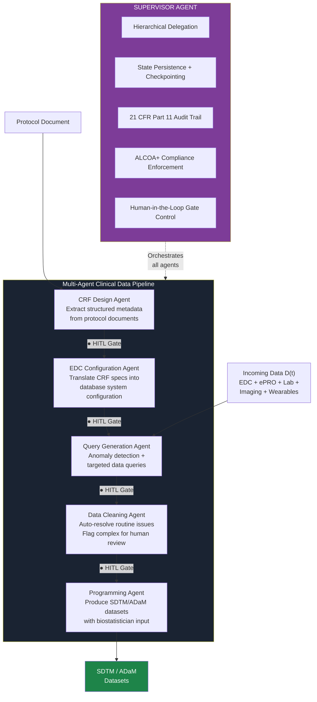
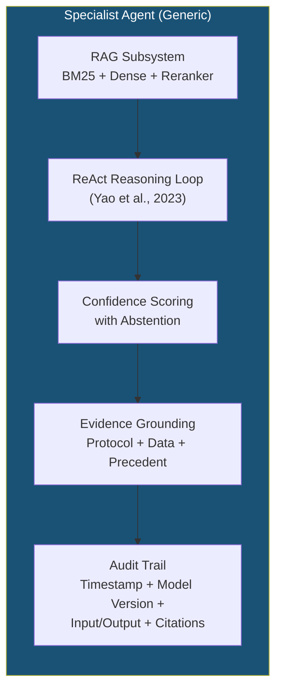
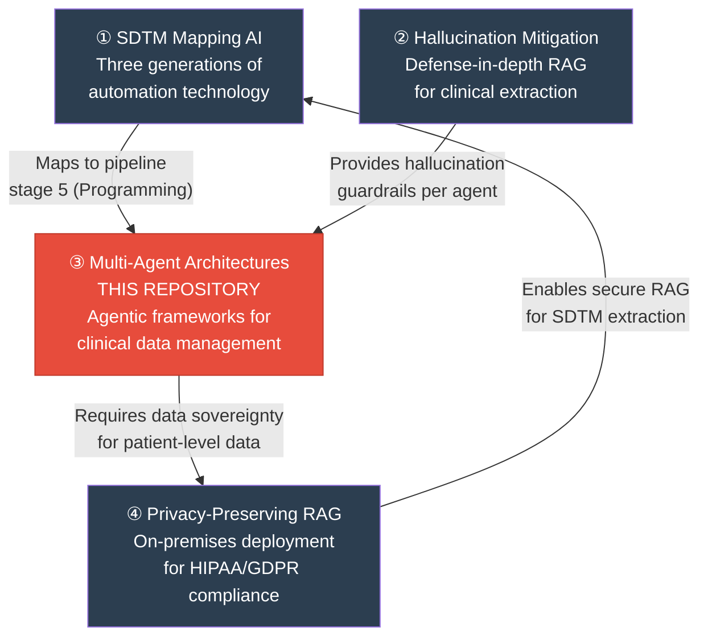

<p align="center">
  <strong>Multi-Agent AI Architectures for Clinical Trial Data Management</strong><br/>
  <em>A Systematic Analysis of the Agentic Framework Landscape, Regulatory Compliance, and Deployment Readiness in 2025–2026</em>
</p>

<p align="center">
  
  
  
  
  
</p>

<p align="center">
  <a href="#the-problem">The Problem</a> •
  <a href="#regulatory-landscape">Regulatory Landscape</a> •
  <a href="#multi-agent-pipeline-architecture">Architecture</a> •
  <a href="#framework-comparison">Frameworks</a> •
  <a href="#evaluation-framework">Evaluation</a> •
  <a href="#research-program-context">Research Program</a> •
  <a href="#citation">Citation</a>
</p>

-----

## The Problem

Clinical trial data management faces mounting complexity that manual processes cannot scale to meet:

|Challenge                    |Scale                                                                                                                                  |
|-----------------------------|---------------------------------------------------------------------------------------------------------------------------------------|
|**Data volume**              |Phase III trials generate an average of **3.6 million data points per study** — 3× the volume of a decade ago (Tufts CSDD, Kaitin 2021)|
|**Query cycle time**         |Mean resolution times of **51.9 days** documented in multinational trials (Tolmie et al., 2011)                                        |
|**Data source fragmentation**|EDC accounts for only ~30% of total study data; remainder from ePRO, labs, imaging, wearables, EHR (Veeva, 2025)                       |
|**Economic impact**          |Late-phase trial delays cost **tens of thousands of dollars per day** (Tufts CSDD, 2024)                                               |
|**Industry projection**      |McKinsey (2025) estimates **75–85%** of pharmaceutical workflows contain tasks amenable to AI agent augmentation                       |

This paper provides a systematic analysis of how **multi-agent AI architectures** — coordinated systems of specialized autonomous agents built on LLM reasoning — can address the clinical data pipeline from CRF design through SDTM/ADaM dataset production, while maintaining compliance with GxP requirements.

> **Important:** McKinsey’s projections are consulting estimates from proprietary, non-peer-reviewed methodology. No controlled empirical evaluation of multi-agent systems in production clinical data management has been published to date.

-----

## Paper Statistics

|Attribute                          |Value                                                                                        |
|-----------------------------------|---------------------------------------------------------------------------------------------|
|**Type**                           |Systematic analysis + pedagogical evaluation framework                                       |
|**References**                     |25+ (ICLR, NeurIPS, COLM, regulatory instruments, industry reports)                          |
|**Frameworks Analyzed**            |5 (LangGraph, Microsoft Agent Framework, CrewAI, OpenAI Agents SDK, LlamaIndex)              |
|**Regulatory Instruments Compiled**|8 (21 CFR Part 11, ALCOA+, GAMP 5, CSA, ICH E6(R3), FDA–EMA 2026, FDA AI Guidance, EU AI Act)|
|**Agent Roles Mapped**             |5 specialists + 1 supervisor orchestrator                                                    |
|**Empirical Results**              |None — pedagogical evaluation framework and illustrative feasibility sketch only             |

-----

## Intended Audience

- **Clinical data management leaders** evaluating agentic AI for trial operations
- **GxP validation teams** assessing orchestration frameworks for regulated deployment
- **Pharmaceutical technology architects** designing multi-agent clinical data pipelines
- **Regulatory affairs professionals** navigating AI governance for drug development
- **AI engineers** building production-grade agent systems for healthcare
- **Legal and compliance counsel** reviewing AI deployment risk in GxP environments

-----

## Regulatory Landscape

The most comprehensive compilation of regulatory instruments applicable to AI-assisted clinical data workflows:

|Instrument                  |Specific Provision                                                                                    |Multi-Agent Implication                                                                                        |
|----------------------------|------------------------------------------------------------------------------------------------------|---------------------------------------------------------------------------------------------------------------|
|**21 CFR Part 11**          |Electronic Records; Electronic Signatures (Oct 2024 final guidance)                                   |Every agent action must produce tamper-evident audit trail entries linking to a responsible human              |
|**ALCOA+ Principles**       |Attributable, Legible, Contemporaneous, Original, Accurate + Complete, Consistent, Enduring, Available|Applies directly to all AI-generated clinical data; provenance for every transformation                        |
|**ISPE GAMP 5 2nd Ed.**     |Appendix D11: AI/ML lifecycle framework (July 2022)                                                   |Model versions must be locked and archived; risk-based validation per CSA                                      |
|**FDA CSA Approach**        |Risk-based validation                                                                                 |Scales assurance activities by process risk — not exhaustive scripted testing                                  |
|**ICH E6(R3)**              |Good Clinical Practice (2025)                                                                         |Updated GCP framework under which clinical data management AI must operate                                     |
|**FDA–EMA Joint Principles**|10 Guiding Principles (January 14, 2026)                                                              |Human-centric design, risk-based approaches, data governance, multidisciplinary expertise, clear context of use|
|**FDA AI Draft Guidance**   |January 6, 2025                                                                                       |Framework for AI use in drug and biological product regulatory decisions                                       |
|**EU AI Act**               |Regulation 2024/1689 (in force August 1, 2024)                                                        |Potential high-risk classification; conformity assessment, QMS, documentation requirements                     |

-----

## Multi-Agent Pipeline Architecture

The reference pipeline maps five specialist agents plus a supervisory orchestrator to the clinical data management workflow articulated by McKinsey (2025), with human-in-the-loop approval gates at each stage transition.

> **Framing:** This is an academic synthesis exercise mapping a publicly available industry analysis onto publicly documented framework design primitives, compiling regulatory compliance considerations from published guidance. It does not constitute a deployable system design.



### Per-Agent Architecture

Each specialist agent incorporates:



### Three-Tier Uncertainty Framework

|Tier                      |Signal                                           |Mechanism                                            |
|--------------------------|-------------------------------------------------|-----------------------------------------------------|
|**Retrieval Uncertainty** |Score gap between top-ranked documents           |If gap < threshold → low retrieval confidence        |
|**Generation Uncertainty**|Token-level entropy; sampling-based consistency  |High variance across samples → flag for review       |
|**Task Uncertainty**      |Comparison against historical resolution patterns|Anomalous divergence from historical norms → escalate|

When aggregate uncertainty exceeds configurable thresholds, agents **abstain** and route to human review.

-----

## Framework Comparison

Five production-grade orchestration frameworks evaluated against clinical data management requirements:

|Characteristic            |LangGraph               |MS Agent Fwk            |CrewAI              |OpenAI SDK           |LlamaIndex         |
|--------------------------|------------------------|------------------------|--------------------|---------------------|-------------------|
|**Architecture**          |Graph / DAG             |Event-driven actor      |Role-based crews    |Minimalist primitives|RAG-first workflows|
|**GA / Stable Release**   |v1.0 (Oct 29, 2025)     |Preview (Oct 1, 2025)   |v1.0 (Oct 20, 2025) |Mar 2025             |v1.0 (Jun 2025)    |
|**Cycle Support**         |Native (Pregel-inspired)|Yes                     |Yes                 |Via handoffs         |Yes                |
|**State Persistence**     |Built-in checkpoints    |Thread-based            |Context sharing     |External             |Workflow state     |
|**Human-in-the-Loop**     |`interrupt()` API       |Approval workflows      |HITL rounds         |Guardrails           |Via callbacks      |
|**Audit Trail**           |LangSmith tracing       |Telemetry infrastructure|Observability layer |Built-in tracing     |Instrumentation    |
|**Production Deployments**|Uber, Klarna, Elastic   |Novo Nordisk            |100K+ devs certified|OpenAI ecosystem     |RAG-heavy apps     |
|**GxP Readiness***        |**High**                |**High**                |Medium              |Low (vendor lock-in) |Medium             |

**Author’s architectural assessment. No framework has undergone formal GxP validation.*

### Framework Selection Criteria

Frameworks were included based on three criteria: (1) evidence of production deployment at enterprise scale, (2) explicit support for multi-agent orchestration patterns, and (3) open-source availability enabling inspection for GxP validation. Notable exclusions: Google ADK (limited production evidence at time of writing), Dify (targets no-code users), Mastra (early-stage).

### Platform Risk Warning

> The AutoGen-to-Microsoft-Agent-Framework merger within months of AutoGen v0.4 illustrates the **platform stability risk** inherent in a rapidly evolving landscape. Organizations investing in GxP validation of a specific framework face the risk of deprecation before validation is complete.

-----

## Evaluation Framework

### Illustrative Feasibility Sketch

The manuscript includes a pedagogical illustration targeting the **Query Generation Agent** — the pipeline stage with the most well-defined inputs and outputs:

|Element               |Specification                                                                                                           |
|----------------------|------------------------------------------------------------------------------------------------------------------------|
|**Framework**         |LangGraph-based single-agent with ReAct reasoning loop                                                                  |
|**Retrieval Corpus**  |5 publicly available Phase III protocol synopses from ClinicalTrials.gov                                                |
|**Synthetic Data**    |100 patients × 10 visits in SDTM Vital Signs (VS) domain                                                                |
|**Injected Anomalies**|20 total: 5 out-of-range BP, 5 temporal inconsistencies, 5 missing required values, 5 cross-field (diastolic > systolic)|
|**Evaluation**        |Precision/recall/F1 vs. gold standard; citation accuracy; qualitative query text clarity                                |


> This sketch covers one of five pipeline stages, uses entirely synthetic data, and describes a single agent. It is a pedagogical illustration, not a validated prototype.

### Clinical Data Management Metrics

|Category               |Metrics                                                                   |
|-----------------------|--------------------------------------------------------------------------|
|**Query Generation**   |Precision / Recall / F1 against expert-annotated gold standard            |
|**Anomaly Detection**  |Sensitivity / Specificity on datasets with injected anomalies             |
|**False Positive Rate**|On verified clean data (critical: elevated FPR erodes clinical team trust)|
|**Resolution Accuracy**|Against actual historical resolution actions                              |

### Three Baselines

|Baseline                                       |Role                                          |
|-----------------------------------------------|----------------------------------------------|
|Deterministic rule-based edit checks           |Current standard of care                      |
|Single-agent LLM (no multi-agent orchestration)|Isolates the value of multi-agent coordination|
|Human data manager inter-rater reliability     |Performance ceiling                           |

### Human Evaluation Rubric

Five dimensions scored by blinded panels of clinical data managers, biostatisticians, and regulatory professionals:

|Dimension                |Definition                                                              |
|-------------------------|------------------------------------------------------------------------|
|**Clinical Accuracy**    |Is the agent’s assessment of the data issue correct?                    |
|**Query Quality**        |Is the generated query clear, actionable, and appropriately targeted?   |
|**Regulatory Compliance**|Does the agent’s action maintain ALCOA+ data integrity?                 |
|**Efficiency Impact**    |Would this agent output save time compared to manual review?            |
|**Safety**               |Does the agent correctly identify and escalate safety-relevant findings?|

5-point Likert scale; minimum 3 blinded reviewers; **Krippendorff’s alpha** for inter-rater reliability; power analysis targeting Cohen’s d ≥ 0.5.

-----

## Scope and Limitations

This paper is an **academic literature synthesis** based on published frameworks, publicly available industry reports, and published regulatory guidance — **not empirical results from controlled deployments**. No validated productivity estimates exist for multi-agent systems in clinical data management. The evaluation framework and feasibility sketch are pedagogical illustrations. Regulatory validation precedents for multi-agent architectures in GxP environments do not yet exist. LLM uncertainty calibration remains unreliable for clinical safety-critical decisions. Data residency constraints may prevent frontier API-based LLM use for patient-level data.

-----

## Repository Structure

```
clinical-query-agent/
├── README.md                                      # This file
├── LICENSE
├── CITATION.cff
└── manuscript/
    └── multi_agent_clinical_data_mgmt.md           # Full manuscript
```

-----

## Research Program Context

This paper is part of a four-paper independent research program examining AI deployment in regulated clinical data environments:



|#    |Repository                                                                                         |Focus                                                                 |
|-----|---------------------------------------------------------------------------------------------------|----------------------------------------------------------------------|
|**1**|[sdtm-mapping-ai](https://github.com/DanielMartin-Arogyasami/sdtm-mapping-ai)                      |Landscape review: three generations of SDTM automation technology     |
|**2**|[clinical-rag-hallucination](https://github.com/DanielMartin-Arogyasami/clinical-rag-hallucination)|Hallucination mitigation architecture deployed within each agent      |
|**3**|**[clinical-query-agent](https://github.com/DanielMartin-Arogyasami/clinical-query-agent)**        |**Multi-agent orchestration for the full clinical data pipeline**     |
|**4**|[privacy-rag-onprem](https://github.com/DanielMartin-Arogyasami/privacy-rag-onprem)                |On-premises infrastructure enabling data sovereignty for agent systems|

-----

## Citation

```bibtex
@article{arogyasami2026multiagent,
  title   = {Multi-Agent AI Architectures for Clinical Trial Data Management:
             A Systematic Analysis of the Agentic Framework Landscape,
             Regulatory Compliance, and Deployment Readiness in 2025--2026},
  author  = {Arogyasami, DanielMartin},
  year    = {2026},
  note    = {Preprint — not yet peer reviewed},
  url     = {https://github.com/DanielMartin-Arogyasami/clinical-query-agent}
}
```

-----

## Author

**DanielMartin Arogyasami** — Enterprise Clinical AI & Data Architect

[LinkedIn](https://linkedin.com/in/danielmba)

-----

## License

This manuscript is shared for academic discussion and independent scholarly review. See <LICENSE> for terms.

-----

## Integrity Statement

This paper was conceived, researched, and written entirely in the author’s personal capacity using publicly available sources. It does not draw on any proprietary data, internal architectures, unpublished strategies, confidential discussions, or trade secrets of any current or former employer. All frameworks, regulatory instruments, industry reports, and academic citations referenced herein are publicly available. The analytical perspectives, architectural mappings, and evaluation designs represent the author’s independent academic synthesis. No funding was received. The author declares no conflicts of interest.

-----

**Keywords:** `multi-agent AI` · `clinical trial data management` · `agentic AI` · `LangGraph` · `CrewAI` · `21 CFR Part 11` · `ALCOA+` · `GAMP 5` · `FDA-EMA 2026` · `GxP validation` · `SDTM` · `ADaM` · `ReAct` · `human-in-the-loop`
